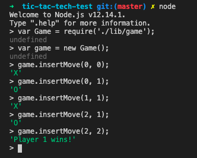

# Tic Tac Toe Tech Test

On week 10 of Makers Academy we are tasked with completing differents tech tests, on a 1.5 days time limit.

Tic tac toe tech test is the second assigned.

## Getting started

1. Fork this repo, and clone it to your local machine, then cd to it
2. If you don't have node installed go to [Node.js](https://nodejs.org/en/)
3. When the installation is completed, run `npm install`

## Test

To run the tests, access the app root folder and use
```
npx jasmine
```

## Usage

To use this app, access the Node REPL with `node` then:

```javascript
var Game = require('./lib/game');

var game = new Game();

game.insertMove(0, 0);
game.insertMove(0, 1);
game.insertMove(1, 1);
game.insertMove(2, 1);
game.insertMove(2, 2);
```



## Approach & code structure

The code is structured in different modules, that are injected to Game to achieve an easily testable and changeable code.

I started with creating a Board constructor, storing the board as a two-dimensional array.

Next, I created a Player constructor, able to hold a name and a sign.

The rules are extracted in a different module, the winning condition is defined in the prototype as a check on a subarray, if all the elements of it are the same the winner is defined.

Columns and diagonals are translated into two-dimensional arrays to reuse the same winning condition.

The Game function injects two standard players, the board and the rules.

Inserting a move on the board, auto-select the right player, increase the turn counter and announce the winning player if one is present.
There are in place different guard clauses for the game over and space filled.

## T&C

Feel free to use this logic to implement a visual game of Tic Tac Toe in your browser.

## Requirements

The rules of tic-tac-toe are as follows:

* There are two players in the game (X and O)
* Players take turns until the game is over
* A player can claim a field if it is not already taken
* A turn ends when a player claims a field
* A player wins if they claim all the fields in a row, column or diagonal
* A game is over if a player wins
* A game is over when all fields are taken

Build the business logic for a game of tic tac toe. It should be easy to implement a working game of tic tac toe by combining your code with any user interface, whether web or command line. 